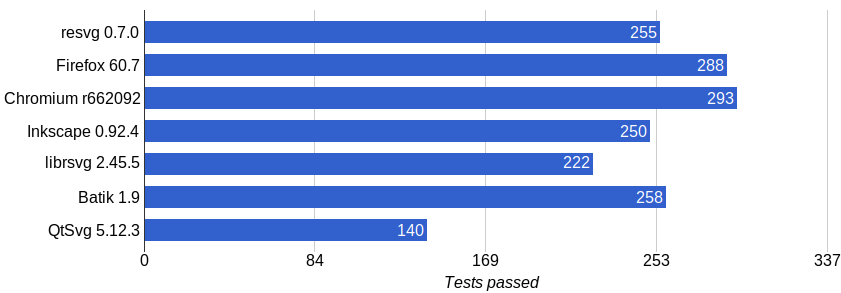
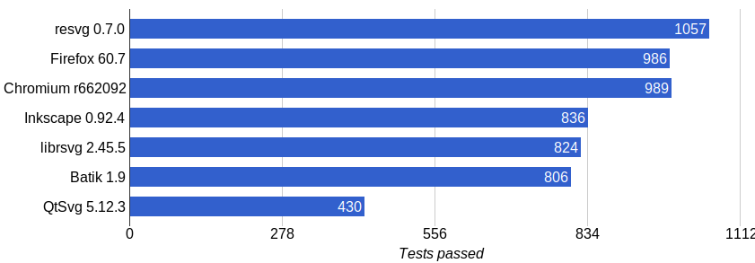

## resvg

*resvg* is an [SVG](https://en.wikipedia.org/wiki/Scalable_Vector_Graphics) rendering library.

## Purpose

*resvg* can be used as:

- a Rust library
- a C library (see [capi](./capi))
- a CLI application (see [tools/rendersvg](./tools/rendersvg))

to render SVG files based on a
[static](http://www.w3.org/TR/SVG11/feature#SVG-static)
[SVG Full 1.1](https://www.w3.org/TR/SVG/Overview.html) subset to raster images or
to a backend's canvas (e.g. to a QWidget via QPainter).

The core idea is to make a fast, small, portable, multiple-backend SVG library
designed for edge-cases.

Another major difference from other SVG rendering libraries is that *resvg* does a lot
of preprocessing before rendering. It converts an input SVG into a simplified one
called [Micro SVG](./docs/usvg_spec.adoc) and only then it begins rendering.
So it's very easy to implement a new rendering backend.
And you can also access *Micro SVG* as XML directly via [usvg](./tools/usvg) tool.

## SVG support

*resvg* is aiming to support only the [static](http://www.w3.org/TR/SVG11/feature#SVG-static)
SVG subset; e.g. no `a`, `script`, `view` or `cursor` elements, no events and no animations.

A list of unsupported features can be found [here](docs/unsupported.md).

[SVG Tiny 1.2](https://www.w3.org/TR/SVGTiny12/) and [SVG 2.0](https://www.w3.org/TR/SVG2/)
are not supported and not planned.

Results of the static subset of the [SVG test suite](https://www.w3.org/Graphics/SVG/Test/20110816/):

Results of the [resvg test suite](https://github.com/RazrFalcon/resvg-test-suite):

You can find a complete table of supported features
[here](https://razrfalcon.github.io/resvg-test-suite/svg-support-table.html).
It also includes alternative libraries.

## Performance

Note that all tested applications have a different SVG support, which impacts the performance.

Also, we do not test against Chrome, Firefox, Inkscape and Batik because they have a huge startup time.

- Elementary Icon Theme contains 3417 files.
- Qt backend is slow because `QRasterPaintEngine` is slow.

- The Oxygen icon theme contains 4947 files.
- All images were converted from `.svgz` to `.svg` beforehand.
- `resvg` is slower than `librsvg` because the Oxygen icon theme uses Gaussian blur heavily,
  and `librsvg` has a faster blur implementation.
  Also, `librsvg` uses native `cairo` clipping, [which is incorrect](https://razrfalcon.github.io/resvg-test-suite/svg-support-table.html#e-clipPath) but faster.
- QtSvg doesn't support `filter`, `clipPath`, `mask` and `pattern` that are heavily used in the Oxygen icon theme.
  So it's actually very slow.

## Building *resvg*

See the [BUILD](BUILD.adoc) document.

## Project structure

- `resvg` – rendering backends implementation
  - [`usvg`](./usvg) – an SVG simplification tool
    - [`roxmltree`](https://github.com/RazrFalcon/roxmltree) – a DOM-like XML tree
      - [`xmlparser`](https://github.com/RazrFalcon/xmlparser) – an XML parser
    - [`svgtypes`](https://github.com/RazrFalcon/svgtypes) – SVG types parser and writer
    - [`simplecss`](https://github.com/RazrFalcon/simplecss) – a simple CSS2 parser
    - [`ttf-parser`](https://github.com/RazrFalcon/ttf-parser) – a TrueType/OpenType parser
    - [`xmlwriter`](https://github.com/RazrFalcon/xmlwriter) – a simple XML writer
    - [`rctree`](https://github.com/RazrFalcon/rctree) – a DOM-like tree
  - [`resvg-qt`](./bindings/resvg-qt) – minimal bindings to [Qt]
  - [`resvg-skia`](./bindings/resvg-skia) – minimal bindings to [Skia]

All other dependencies aren't written by me for this project.

## Directory structure

- `bindings` – minimal bindings to Qt and Skia used by *resvg*
- `capi` – C interface for *resvg*
- `docs` – basic documentation
- `examples` – usage examples for *resvg* as a library
- `src` – source code
- `testing-tools` – scripts used for testing
- `tools` – useful tools
- `usvg` – an SVG simplification library used by *resvg*

## Safety

- The library must not panic. Any panic should be considered a critical bug and should be reported.
  There are only a few methods that can produce a panic.
- The core library structure (see above) does not use any `unsafe`,
  but since all backends are implemented via FFI, we are stuck with `unsafe` anyway.
  Also, `usvg` uses unsafe for fonts memory mapping.

## License

*resvg* is licensed under the [MPLv2.0](https://www.mozilla.org/en-US/MPL/).

[Inkscape]: https://www.inkscape.org
[librsvg]: https://wiki.gnome.org/action/show/Projects/LibRsvg
[QtSvg]: https://doc.qt.io/qt-5/qtsvg-index.html

[cairo]: https://www.cairographics.org/
[Qt]: https://www.qt.io/
[Skia]: https://skia.org/

[GNOME]: https://www.gnome.org/
